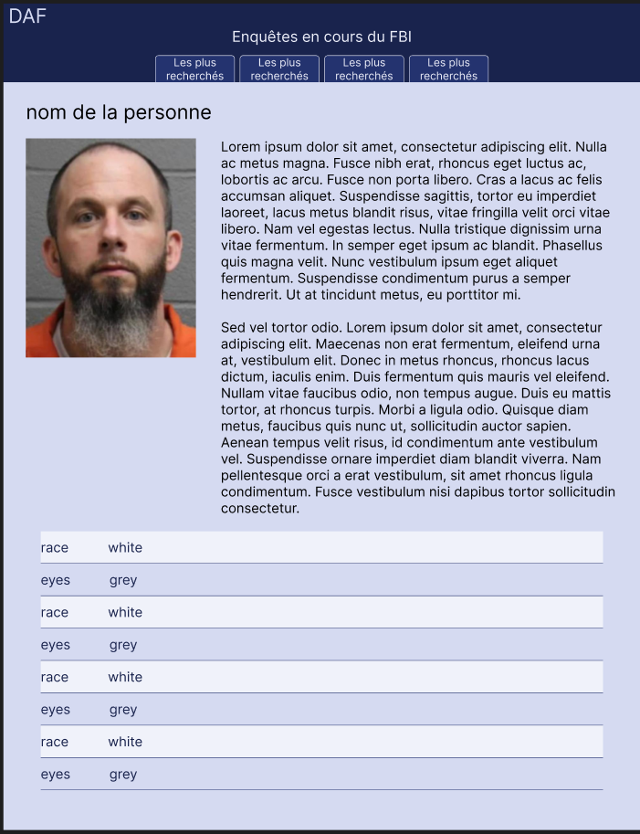

# Projet-collectif-nantes-dataviz-daf

Données FBI: [Lien API](https://api.fbi.gov/wanted)

Docs API: [Lien API](https://api.fbi.gov/docs)

## Vue d'ensemble

Ce projet a pour but de créer une application web de visualisation de données sur les personnes recherchées par le FBI. L'application permettra de visualiser les données sous forme de graphiques et de cartes.

## Débuter

### Installation

1. **Cloner le repo**

```
git clone git@github.com:adatechschool/projet-collectif-nantes-dataviz-daf.git
```

2. **Se déplacer dans le dossier du projet**

```
cd projet-collectif-nantes-dataviz-daf
```

3. **Installer les dépendances**

```
npm install
```

#### Node modules

Dossier généré automatiquement avec `npm install` (terminal)

#### .gitignore

Permet de lister tous les fichiers et dossiers qui ne seront pas envoyés sur github

#### eslint

Commande terminal : `npm init @eslint/config@latest`
A ajouté des informations dans le package.json
A généré le eslint.config.mjs
Cela permet de vérifier la syntaxe du code et règle automatiquement les problèmes.

#### package-lock.json

La commande terminal `npm install` génère automatiquement : package-lock.json
Ces fichiers gèrent les dépendances du projet.

#### package.json

- Fichier généré automatiquement avec `npm init -y` (terminal)
- Contient les informations du projet et les dépendances

```json
"dependencies": {
  "chart.js": "^4.4.6"
  },
```

- Commande terminal : `npm run prettier:lint`
- Permet de formater le code et de vérifier les erreurs.

```json
"scripts": {
  "prettier:lint": "prettier --write --check . && eslint --fix ."
  },
```

#### .prettierrc

- Outil de mise en forme du code afin d'harmoniser le code entre les différents développeurs.
- Installé avec la commande terminal : `npm install --save-dev --save-exact prettier`
- Pour éviter les conflits avec eslint : commande terminal `node --eval "fs.writeFileSync('.prettierrc','{}\n')"`
- Après formatage, tout ce qui sera dans le .prettierignore ne sera pas pris en compte : commande terminal `node --eval "fs.writeFileSync('.prettierignore','# Ignore artifacts:\nbuild\ncoverage\n')"`

## Git

### Configuration git

Pour assurer la conformité sur la gestion des fins de lignes, il est recommandé de configurer git avec les commandes suivantes :

```
git config core.autocrlf false
git config core.eol lf
```

Pour automatiquement supprimer les branches distantes en local :

```
git config fetch.prune true
```

Pour sélectionner le rebase par défaut lors d'un pull :

```
git config pull.rebase true
```

### Git workflow

#### Branches primordiales

- **main** : branche principale à ne pas toucher _(sauf pour les mise en production)_

- **dev** : branche de développement _(à partir de laquelle on crée des branches de fonctionnalités et on merge les branches de fonctionnalités)_

#### Branches de fonctionnalités

- **feature/(nom-de-la-fonctionnalité-initiale-dev)** : branche de fonctionnalité _(à partir de la branche dev)_

#### Stand up meeting

- s'assurer d'avoir la dernière version de la branche dev et faire la mise à jour du backlog.
- faire une code review de la branche dev

## Processus git flow pour une nouvelle fonctionnalité

Avant de commencer :
1. `git checkout dev` : on se place sur la branche dev
2. `git pull origin dev` : on s'assure de récupérer les mises à jour de la branche dev
3. `git branch feature/(nom-de-la-fonctionnalité)` : on crée une nouvelle branche de fonctionnalité
4. `git checkout feature/(nom-de-la-fonctionnalité)` : on se place sur la nouvelle branche de fonctionnalité

Après avoir effectué des modifications :
5. `npm run prettier:lint` : on formate le code et on vérifie les erreurs
6. `git add .` : on ajoute les fichiers modifiés
7. `git commit -m "message"` : on commit les modifications
8. `git push origin feature/(nom-de-la-fonctionnalité)` : on push la branche de fonctionnalité sur le repo distant
9. on crée une pull request sur github pour merger la branche de fonctionnalité sur la branche dev
10. En cas de conflit, on résout le conflit en local, on commit et on push à nouveau
11. Code review de la branche dev (en équipe)
12. récupération des mises à jour de la branche dev

## WIREFRAMES


## MAQUETTES




## Annexes

### .env (fichier supprimé car plus besoin)

- Fichier créé avec `touch .env`
- Contient toutes les données sensibles non publiques (répertoriées dans `.gitignore`)
- A créer sur chaque poste de travail

#### .env.sample

- Fichier créé avec `touch .env.sample`
- Contient les variables d'environnement du fichier `.env` avec des indications sur les valeurs à renseigner
